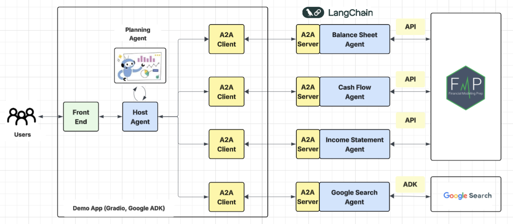
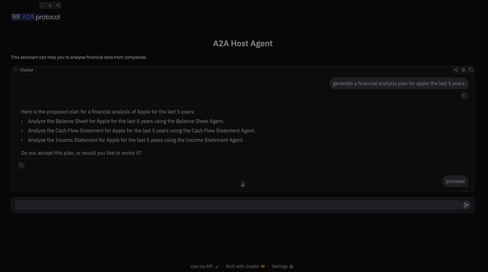

# AgenticAI-A2A  for Stock-Analysis


 
This agentic AI DK-2A system is designed to perform comprehensive financial analysis by coordinating multiple specialized agents. 

## Agentic AI Architecture





Each agent focuses on a critical component of company evaluation, enabling structured, multi-dimensional insights.


 What the System Can Do:


### 1. Balance Sheet Trend Analysis Agent

   * Analyzes balance sheet data across multiple time periods

   * Evaluates changes in assets, liabilities, and equity

   * Identifies trends in liquidity, leverage, and capital structure

   * Highlights financial stability and long-term solvency patterns


### 2. Cash Flow Statement Trend Analysis Agent

   * Examines operating, investing, and financing cash flows over time

   * Assesses cash generation quality and sustainability

   * Detects capital allocation patterns

   * Identifies potential liquidity risks or strengths


### 3. Income Statement Trend Analysis Agent

   * Tracks revenue growth, profitability, and expense trends

   *  Analyzes margins (gross, operating, net) across periods

   *  Evaluates earnings consistency and operational performance

   *  Identifies improving or deteriorating financial performance


### 4. Industry Comparative Analysis (Search Agent)

   *  Conducts structured competitive analysis against leading industry peers

   * Evaluates:

     * Market position

     * Financial performance

     * Operational efficiency

     * Innovation capacity

     *  Brand strength

     *  Strategic direction

     * Identifies key competitive advantages and disadvantages


The UI that allows us to interact with the Agentic AI:




## Setup and Deployment

---

Before running the app locally, ensure you have the following:

1. uv: The python package management tool. To create a virtual environment and
   install all listed dependencies, run:
   ```shell
   uv install
   ```
2. python 3.13 is required to run a2a-sdk
3. set up .env
* Create an `.env` file in the folders: `host`, `financial_agent`, `cashflow_agent`, `balancesheet_agent` and `search_agents` with the following content:
 ```shell
GOOGLE_API_KEY="your_api_key_here" 
GOOGLE_GENAI_MODEL="gemini-2.5-flash"
GOOGLE_GENAI_USE_VERTEXAI=FALSE
GOOGLE_CLOUD_LOCATION="global"
```

You can customize the `.env` file in each agent based on the needs of the application.


## 1. Run Financial Agent
___

```shell
cd src/financial_agent
uv run main.py
```


## 2. Run Cash Flow Agent
___

```shell
cd src/cashflow_agent
uv run main.py
```

## 3. Run Balance Sheet Agent
___

```shell
cd src/balancesheet_agent
uv run main.py
```

## 4. Run the Search Agent 

```shell
cd src/search_agents
uv run main.py
```

## 5. Run Host Agent
___                                                                                                                                                                                  

```shell
cd src/host
uv run main.py
```

## 6. Access and Test the agentic solution on the UI
___

```shell
http://localhost:8083/
```